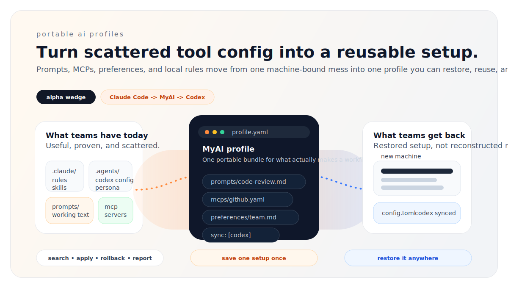

<div align="center">

# MyAI

### Portable AI profiles for developers and teams

Save a working AI setup once. Restore it on a new machine. Reuse it across tools.

<p>
  
  
  
  
</p>

<p>
  <a href="#import-your-current-claude-code-setup"><strong>Import</strong></a> ·
  <a href="#new-team-member-quickstart"><strong>Bootstrap</strong></a> ·
  <a href="#install"><strong>Install</strong></a> ·
  <a href="#why-developers-and-teams-reach-for-it"><strong>Why</strong></a> ·
  <a href="#current-support-matrix"><strong>Support</strong></a> ·
  <a href="#docs"><strong>Docs</strong></a>
</p>



</div>

> The AI workflow that "works" inside a team is usually real, valuable, and trapped on one laptop.  
> MyAI turns that fragile setup into a reusable local-first `profile`.

**Alpha status:** narrow by design. Shipping path today is `Claude Code -> MyAI repo -> Codex CLI`.

## Why Developers And Teams Reach For It

When a team says "our AI workflow works," what that often means is:

- one person figured out the setup
- everyone else copies fragments by hand
- a new machine means rebuilding from memory
- a new tool means starting over

MyAI exists to make the setup itself portable, not just the output.

## What You Can Do With It

- import a working Claude Code setup into a reusable profile
- search and list saved profiles locally
- apply a saved profile and roll it back safely
- bootstrap a new teammate or new machine from team defaults
- sync the supported Codex subset without rewriting config by hand

## Why It Feels Different

| Most AI repos save | MyAI saves |
| --- | --- |
| isolated prompts | a portable working `profile` |
| machine-local tweaks | materialized, rollback-safe local state |
| tool-specific configs | reusable assets plus explicit sync |
| tribal knowledge | searchable reuse and restore telemetry |

This alpha does not try to support every tool.
It tries to prove that one valuable setup can survive tool switching, teammate onboarding, and machine resets.

## Who It Is For

| Good fit | Not the first target |
| --- | --- |
| engineering teams already using Claude Code and Codex | solo prompt collectors with no repeat workflow |
| teams onboarding new machines or teammates often | teams looking for hosted analytics first |
| operators who want files, Git, and local control | teams needing every AI tool supported on day one |

## Current Support Matrix

| Capability | Status | Notes |
| --- | --- | --- |
| Import from Claude Code | yes | Reads `CLAUDE.md` and supported MCP config from `~/.claude.json` |
| Local profile search/list/show | yes | Search telemetry is written to local event logs |
| Apply and rollback | yes | Materializes to `.myai-applied/` with backup and restore flow |
| Sync to Codex | yes | Current target is the supported Codex MCP subset |
| Pilot reporting | yes | Repo-local summary for reuse, search, actor, and machine metrics |
| Cursor target | later, only after the current wedge proves out | Not implemented in `v0.1` |
| ChatGPT / hosted sync | not yet | Deliberately out of `v0.1` scope |

### Core Principles

- **Local-first** — your data lives in `~/.myai/`, a plain Git repo you own
- **Portable by default** — stored data remains readable without MyAI
- **Team-oriented** — workflows are inheritable, not trapped with one person
- **Narrow first** — solve one portability path well before expanding
- **Standard formats** — Markdown + YAML, no vendor lock-in

## Install

Current release track: `0.1.0-alpha`.

```bash
npm install -g @myai/cli
myai help
```

Or run without a global install:

```bash
npx @myai/cli help
```

Requirements:

- Node.js 18+

## Import Your Current Claude Code Setup

```bash
cd /path/to/your/claude-code-project
myai init
myai profile import --from claude-code
myai profile list
```

If you want a stable name instead of using the current directory:

```bash
myai profile import code-review --from claude-code
```

## What Import Reads From Claude Code

- `CLAUDE.md`
- matching project `mcpServers` from `~/.claude.json`
- it does **not** import `.claude/settings.local.json`, local permissions, or chat history

## New Team Member Quickstart

```bash
git clone <your-team-myai-repo> ~/.myai
npm install -g @myai/cli
cd /path/to/your/work-repo
myai bootstrap team-default --target-dir . --yes
```

If the profile declares `sync.targets: [codex]`, bootstrap also restores the supported Codex config.

## Try The Included Demo Repo

```bash
myai profile list --repo ./examples/sample-repo
myai profile show code-review --repo ./examples/sample-repo
myai profile apply code-review --repo ./examples/sample-repo --target-dir /tmp/myai-demo --yes
```

## Optional Pilot Telemetry

You do not need any telemetry env vars for normal use.
If you are running an internal pilot and want stable attribution across operators or machines, set:

```bash
export MYAI_ACTOR_ID=pilot-operator-1
export MYAI_MACHINE_ID=macbook-air-01
```

`myai report summary` then surfaces unique actors, unique machines, search volume, zero-result searches, and search-to-reuse within 24 hours. Logs stay local under `~/.myai/logs/`.

## Storage

```
~/.myai/
├── prompts/              # Saved prompts (Markdown)
├── mcps/                 # MCP server configs (normalized format)
├── preferences/          # Team and personal rules
├── profiles/
│   ├── team/
│   └── personal/
├── skills/               # Optional workflow templates (light support)
├── logs/                 # Local event logs for pilot validation
└── myai.yaml             # Repo config
```

It's just files. Back it up with Git. Share it with your team. Move it to a new machine in 30 seconds.

## Current Focus

v0.1 focuses on one narrow promise:

**A team can save a working AI profile in one place and restore or reuse it across people and machines without starting from zero.**

- Primary portability path: **Claude Code → Codex CLI**
- Product surface: local repo + CLI
- Target users: AI-native engineering teams (5-30 members) using multiple AI tools

## Docs

| Doc | What it covers |
|-----|---------------|
| [STRATEGY.md](./STRATEGY.md) | Product strategy, ICP, wedge, pricing, GTM, kill criteria |
| [PRD-v0.1.md](./PRD-v0.1.md) | v0.1 scope, requirements, use cases, success metrics |
| [repository-schema.md](./docs/specs/repository-schema.md) | On-disk repository layout, namespaces, logs, bootstrap defaults |
| [profile-schema.md](./docs/specs/profile-schema.md) | Main product object schema and validation rules |
| [cli-command-spec.md](./docs/specs/cli-command-spec.md) | CLI command contract, flags, defaults, and exit codes |
| [claude-code-to-codex-mapping.md](./docs/specs/claude-code-to-codex-mapping.md) | Supported portability subset and explicit warning policy |
| [fresh-machine-pilot-runbook.md](./docs/runbooks/fresh-machine-pilot-runbook.md) | Step-by-step fresh-machine and pilot validation flow |
| [internal-dry-run-2026-03-30.md](./docs/reports/internal-dry-run-2026-03-30.md) | Repo-local dry run record and current validation gaps |
| [github-launch-kit.md](./docs/marketing/github-launch-kit.md) | Suggested GitHub repo description, topics, tagline, and social preview metadata |
| [examples/README.md](./examples/README.md) | Sample repository for demos, pilots, and manual testing |
| [IDEA-archive.md](./docs/archive/IDEA-archive.md) | Early vision exploration (historical) |

## License

MIT
